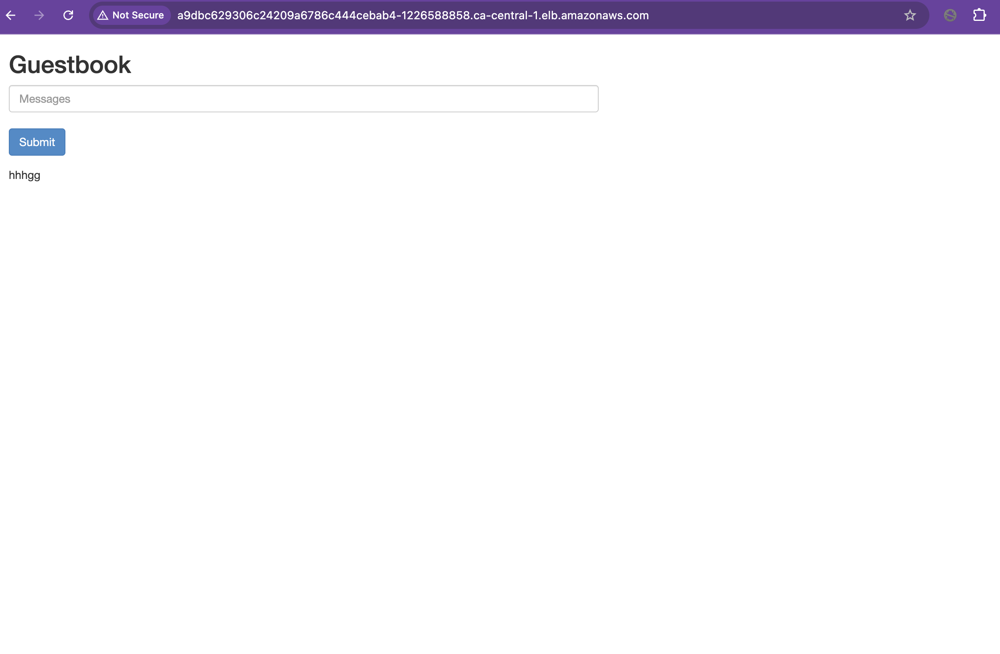
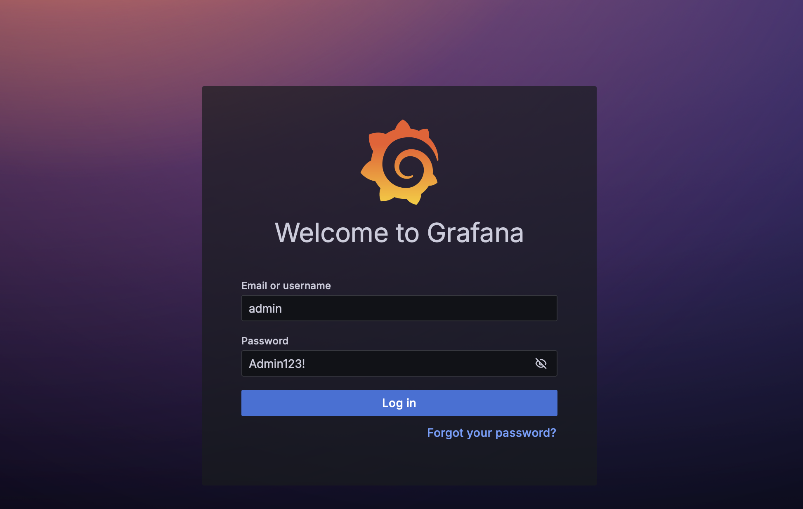
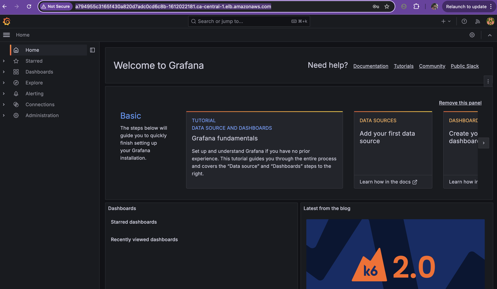
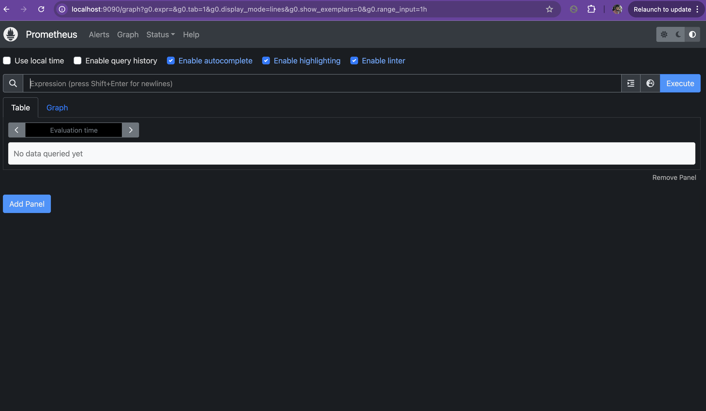
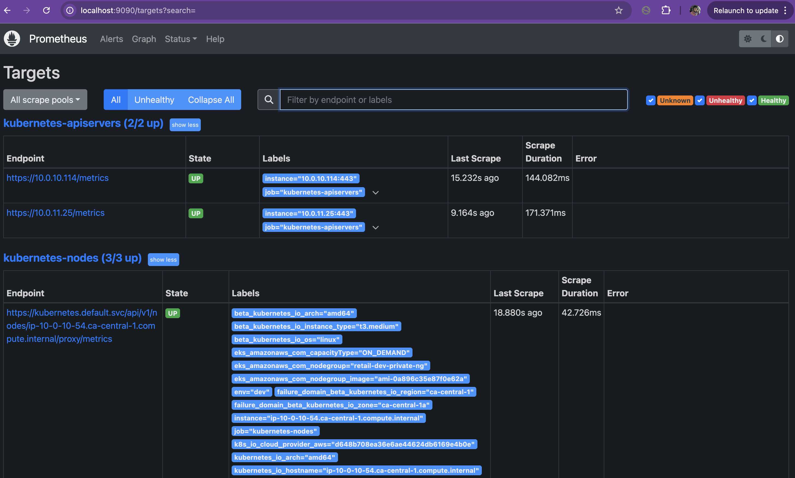
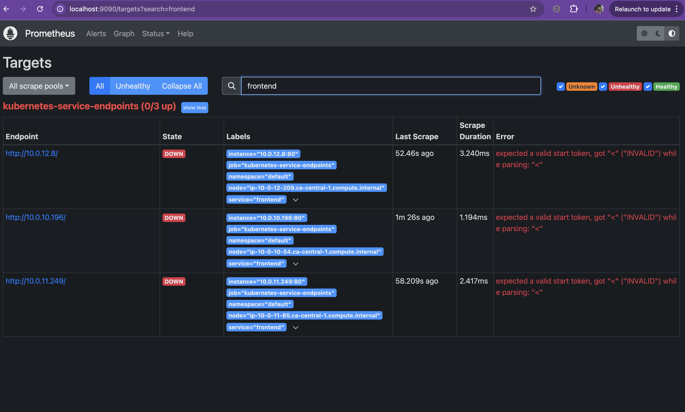
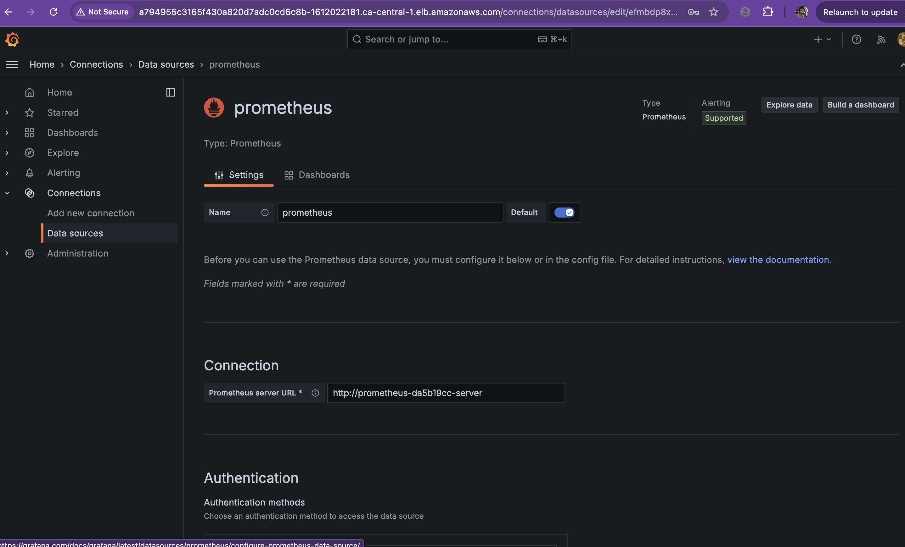
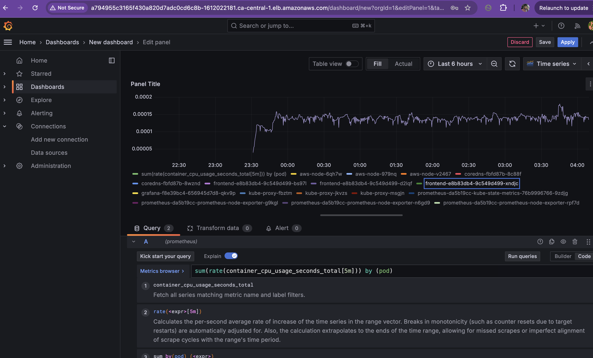

# Guestbook Monitoring with Pulumi, Kubernetes, Prometheus and Grafana

## Overview
This project deploys the Kubernetes Guestbook application using Pulumi TypeScript on Amazon EKS. The Amazon EKS was developed using pulumi on Java as my prefered language. 

The solution integrates:
- Kubernetes
- Pulumi
- Amazon EKS
- Prometheus
- Grafana
- Helm Charts

The monitoring stack provides visibility into cluster and application performance.
---
## Architecture
Frontend Service
Redis Leader
Redis Replica
Prometheus Monitoring
Grafana Dashboard
---
## Prerequisites
- Node.js
- Pulumi CLI
- kubectl
- AWS CLI
- EKS Cluster
- Helm
---
## Project file structure :

4IR-GUESTBOOK-MONITORING/
│
├── eks-cluster/
├── examples/
│   └── kubernetes-ts-guestbook/
│       └── simple/
│           ├── imgs/
│           ├── node_modules/
│           ├── index.ts
│           ├── 📊monitoring.ts  ✔️  
│           ├── package-lock.json
│           ├── package.json
│           ├── Pulumi.yaml
│           ├── README.md
│           └── tsconfig.json
│
├── vpc/
├── create-cluster.sh
├── destroy-cluster.sh
└── README.md

The examples folder holds the kubernetes guestbook project. There are two variants, the simple and  component variants. My project extended the simple variant by adding monitoring with premetheus and grafana according to the instruction on the email. 

Th cluster and vpc modules where written in Java. So if you want to use that for eks cluster testing, you must have atleast java 11 SDK installed in your coding machine.

## Requirements for using the scripts :
- macOS/Linux OR
- Windows with Git Bash OR WSL
- JavaSDK 11+
- Visual Code with java dependencies enabled for viewing codes or bash cat fileName

## First Step: EKS CLUSTER creation

- Set your aws cli and makes sure you signed on via aws cli and also run AWS_PROFILE=YOUR_PROFILE_NAME eg. devops or
- run aws sts get-caller-identity --profile YOUR_PROFILE_NAME eg devops
- Run the script on parent folder to create the cluster on aws.

## scripts/
   ├── create-cluster.sh  
   ├── destroy-cluster.sh

- ./create-cluster.sh and ./destroy-cluster.sh after the testing to billing from Amazon provider. The scripts are already executable (-rwxr-xr-x@) or 755

## If you want run this project without the script.

1. Deploy the VPC first:
   cd vpc
   pulumi up
2. Get the VPC stack reference:
   pulumi stack ls
3. Copy the stack reference from the URL/name.
   Format:
   organization/project/stack
   Example:
   christianRibig5/vpc/dev
4. Open:
   eks-cluster/src/main/java/myproject/Variables.java
5. Replace:
   REPLACE_WITH_VPC_STACK_REFERENCE
   with your real VPC stack reference.
6. Deploy EKS:
   cd ../eks-cluster
   pulumi up
   --

   
## What is new (the extended code)
- cretaed the monitoring script to monitoring.ts and called from the index.ts exixting code 
- Purpose of the script is to install prometheus, grafana and helm chart via pulumi  

## Runing the monitoring assignment
1. Confirm that your cluster is running by 
   kubectl version 
   if it fails make sure you, 
2. Configure kubectl  by runing bash : "aws eks update-kubeconfig --name retail-dev-eksdemo on" terminal and 
   reconfirm if kubectl version is working
3. cd ./examples/kubernetes-ts-guestbook/simple
4. npm install
5. pulumi up

6. kubectl get pods -n monitoring
NAME                                                          READY   STATUS    RESTARTS   AGE
grafana-f8e39bc4-656945d7d8-qkv9p                             1/1     Running   0          21m
prometheus-da5b19cc-kube-state-metrics-76b9996766-9zdjg       1/1     Running   0          21m
prometheus-da5b19cc-prometheus-node-exporter-g9kgl            1/1     Running   0          21m
prometheus-da5b19cc-prometheus-node-exporter-n6gd9            1/1     Running   0          21m
prometheus-da5b19cc-prometheus-node-exporter-rpf7d            1/1     Running   0          21m
prometheus-da5b19cc-prometheus-pushgateway-545ccb69d7-7wzcq   1/1     Running   0          21m
prometheus-da5b19cc-server-59459bd7ff-ljvtt                   2/2     Running   0          2m1s
christianonyeukwu@Christians-MacBook-Air simple % kubectl get svc -n monitoring
NAME                                           TYPE           CLUSTER-IP      EXTERNAL-IP                                                                  PORT(S)        AGE
grafana-f8e39bc4                               LoadBalancer   172.20.105.86   a794955c3165f430a820d7adc0cd6c8b-1612022181.ca-central-1.elb.amazonaws.com   80:31443/TCP   21m
prometheus-da5b19cc-kube-state-metrics         ClusterIP      172.20.223.96   <none>                                                                       8080/TCP       21m
prometheus-da5b19cc-prometheus-node-exporter   ClusterIP      172.20.223.72   <none>                                                                       9100/TCP       21m
prometheus-da5b19cc-prometheus-pushgateway     ClusterIP      172.20.40.150   <none>                                                                       9091/TCP       21m
prometheus-da5b19cc-server                     ClusterIP      172.20.196.1    <none>                                                                       80/TCP         21m

7. kubectl get svc frontend -o yaml 
apiVersion: v1
kind: Service
metadata:
  annotations:
    prometheus.io/path: /
    prometheus.io/port: "80"
    prometheus.io/scrape: "true"            👈 verify that Guestbook metrics are being scraped by Prometheus
  creationTimestamp: "2026-05-17T02:50:06Z"
  finalizers:
  - service.kubernetes.io/load-balancer-cleanup
  name: frontend
  namespace: default
  resourceVersion: "12381"
  uid: 9dbc6293-06c2-4209-a678-6c444cebab4c
spec:
  allocateLoadBalancerNodePorts: true
  clusterIP: 172.20.137.9
  clusterIPs:
  - 172.20.137.9
  externalTrafficPolicy: Cluster
  internalTrafficPolicy: Cluster
  ipFamilies:
  - IPv4
  ipFamilyPolicy: SingleStack
  ports:
  - nodePort: 31037
    port: 80
    protocol: TCP
    targetPort: 80
  selector:
    app: frontend
  sessionAffinity: None
  type: LoadBalancer
status:
  loadBalancer:
    ingress:
    - hostname: a9dbc629306c24209a6786c444cebab4-1226588858.ca-central-1.elb.amazonaws.com

## Result
- Guesbook Access Url: http://http://a9dbc629306c24209a6786c444cebab4-1226588858.ca-central-1.elb.amazonaws.com/
   
- Grafana Access URL:  http://a794955c3165f430a820d7adc0cd6c8b-1612022181.ca-central-1.elb.amazonaws.com
- Usernane: admin
- Password: Admin123!
   

## Verifying Metrics Scraping

1. Port-forward Prometheus:
   kubectl port-forward -n monitoring svc/prometheus-server 9090:80

2. Open:
   http://localhost:9090

3. Navigate to:
   Status -> Targets

4. Verify Guestbook targets show as UP.

The monitoring stack was successfully exposed using a Kubernetes LoadBalancer service.

## Dashborad Screenshots Image Views

## Destroy the infrastructures in your AWS after testing to avoid unexpected billing.
1. on the parent folder 
   cd eks-cluster
   pulumi destroy --yes
   wait until the infrastructures are destroyed and then step 2
2. cd ../vpc
   pulumi destroy --yes
   wait until the vpc are destroyed